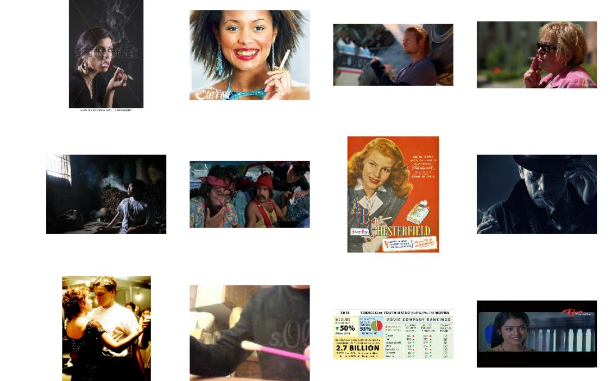

# Hi, this is a Illegal_activity tracker project
Data for the processes <a hreh="https://github.com/sreeragrnandan/Data_Track_illegal_activities">[Click here](https://github.com/sreeragrnandan/Data_Track_illegal_activities)</a>
<br /> We are planing to make a system that will report illegal activities like smoking in public place, child begging/labour and 
women haresment
## Project Stage This Far
1) Made model for smoking issue (check whether a person is smoking or not) using Max Pooling technique (If there is a better technique    please correct us) 
<br />2)Data collection in progress (we are collecting as much as data we can) please visit the above link to see the datas
### Apporach 
We are using TensorFlow to construct the model(neural network)
#### Data into two Train and Validation
First the data is splitted into two Train and Validation
```python
train_dir = os.path.join(base_dir, 'train')
validation_dir = os.path.join(base_dir, 'validation')
# Directory with our training smoking pictures
train_smoking_dir = os.path.join(train_dir, 'smoking')
# Directory with our training not_smoking pictures
train_not_smoking_dir = os.path.join(train_dir, 'not_smoking')
# Directory with our validation smoking pictures
validation_smoking_dir = os.path.join(validation_dir, 'smoking')
# Directory with our validation not_smoking pictures
validation_not_smoking_dir = os.path.join(validation_dir, 'not_smoking')
```
#### Data vissualization
We are using matplotlib to make verify that Image is correctly organized
```python
for i, img_path in enumerate(next_smoking_pix+next_not_smoking_pix):
  # Set up subplot; subplot indices start at 1
  sp = plt.subplot(nrows, ncols, i + 1)
  sp.axis('Off') # Don't show axes (or gridlines)

  img = mpimg.imread(img_path)
  plt.imshow(img)
```

#### Making layers of CNN

```python
from tensorflow.keras import layers
from tensorflow.keras import Model

# Our input feature map is 150x150x3: 150x150 for the image pixels, and 3 for
# the three color channels: R, G, and B
img_input = layers.Input(shape=(150, 150, 3))

# First convolution extracts 16 filters that are 3x3
# Convolution is followed by max-pooling layer with a 2x2 window
x = layers.Conv2D(16, 3, activation='relu')(img_input)
x = layers.MaxPooling2D(2)(x)

# Second convolution extracts 32 filters that are 3x3
# Convolution is followed by max-pooling layer with a 2x2 window
x = layers.Conv2D(32, 3, activation='relu')(x)
x = layers.MaxPooling2D(2)(x)

# Third convolution extracts 64 filters that are 3x3
# Convolution is followed by max-pooling layer with a 2x2 window
x = layers.Conv2D(64, 3, activation='relu')(x)
x = layers.MaxPooling2D(2)(x)

# Create a fully connected layer with ReLU activation and 512 hidden units
x = layers.Flatten()(x)
# Create a fully connected layer with ReLU activation and 512 hidden units
x = layers.Dense(512, activation='relu')(x)
# Create output layer with a single node and sigmoid activation
output = layers.Dense(1, activation='sigmoid')(x)
# Create Model
# input = input feature map
# output = input feature map + stacked convolution/maxpooling layers + fully 
# connected layer + sigmoid output layer
model = Model(img_input, output)
```
