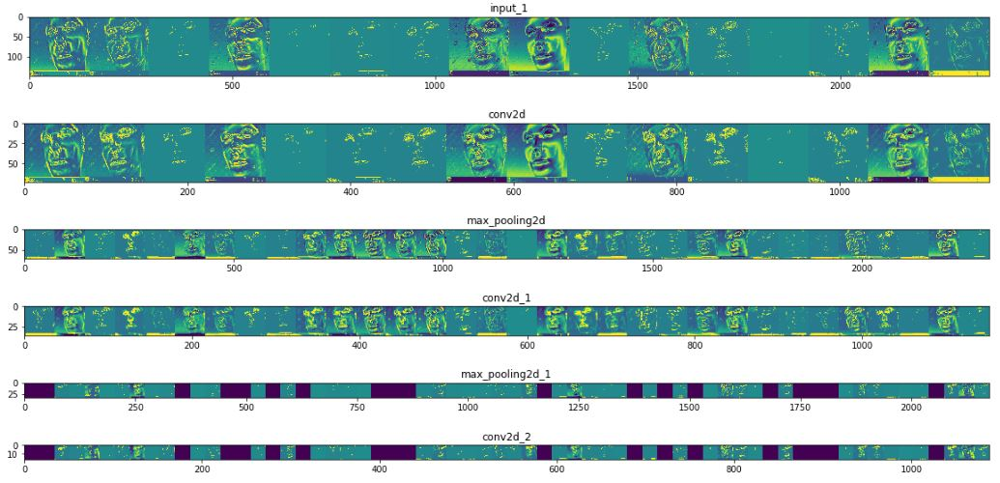
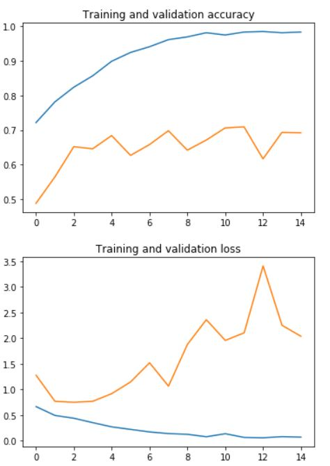

# Hi, this is a Illegal_activity tracker project
Data for the processes <a hreh="https://github.com/sreeragrnandan/Data_Track_illegal_activities">[Click here](https://github.com/sreeragrnandan/Data_Track_illegal_activities)</a>
<br /> We are planing to make a system that will report illegal activities like smoking in public place, child begging/labour and 
women haresment
## Project Stage This Far
1) Made model for smoking issue (check whether a person is smoking or not) using Max Pooling technique (If there is a better technique    please correct us) 
<br />
2) Data collection in progress (we are collecting as much as data we can) please visit the above link to see the data
<br />

### Apporach 
We are using TensorFlow to construct the model(neural network)
#### Data into two Train and Validation
First the data is splitted into two Train and Validation
```python
train_dir = os.path.join(base_dir, 'train')
validation_dir = os.path.join(base_dir, 'validation')
# Directory with our training smoking pictures
train_smoking_dir = os.path.join(train_dir, 'smoking')
# Directory with our training not_smoking pictures
train_not_smoking_dir = os.path.join(train_dir, 'not_smoking')
# Directory with our validation smoking pictures
validation_smoking_dir = os.path.join(validation_dir, 'smoking')
# Directory with our validation not_smoking pictures
validation_not_smoking_dir = os.path.join(validation_dir, 'not_smoking')
```
#### Data vissualization
We are using matplotlib to make verify that Image is correctly organized
```python
for i, img_path in enumerate(next_smoking_pix+next_not_smoking_pix):
  # Set up subplot; subplot indices start at 1
  sp = plt.subplot(nrows, ncols, i + 1)
  sp.axis('Off') # Don't show axes (or gridlines)

  img = mpimg.imread(img_path)
  plt.imshow(img)
```

<br />

#### Making layers of CNN

```python
from tensorflow.keras import layers
from tensorflow.keras import Model

# Our input feature map is 150x150x3: 150x150 for the image pixels, and 3 for
# the three color channels: R, G, and B
img_input = layers.Input(shape=(150, 150, 3))

# First convolution extracts 16 filters that are 3x3
# Convolution is followed by max-pooling layer with a 2x2 window
x = layers.Conv2D(16, 3, activation='relu')(img_input)
x = layers.MaxPooling2D(2)(x)

# Second convolution extracts 32 filters that are 3x3
# Convolution is followed by max-pooling layer with a 2x2 window
x = layers.Conv2D(32, 3, activation='relu')(x)
x = layers.MaxPooling2D(2)(x)

# Third convolution extracts 64 filters that are 3x3
# Convolution is followed by max-pooling layer with a 2x2 window
x = layers.Conv2D(64, 3, activation='relu')(x)
x = layers.MaxPooling2D(2)(x)

# Create a fully connected layer with ReLU activation and 512 hidden units
x = layers.Flatten()(x)
# Create a fully connected layer with ReLU activation and 512 hidden units
x = layers.Dense(512, activation='relu')(x)
# Create output layer with a single node and sigmoid activation
output = layers.Dense(1, activation='sigmoid')(x)
# Create Model
# input = input feature map
# output = input feature map + stacked convolution/maxpooling layers + fully 
# connected layer + sigmoid output layer
model = Model(img_input, output)
```


#### Compiling model
We are using ```binary_crossentropy``` as loss function ```RMSprop``` as optimizer with learning rate ```0.001```
```python
model.compile(loss='binary_crossentropy',
              optimizer=RMSprop(lr=0.001),
              metrics=['acc'])
```
#### Checking result from each layers
To check whether the intermediate layer are working properly we are executing this step



```python
import numpy as np
import random
from tensorflow.keras.preprocessing.image import img_to_array, load_img

# Let's define a new Model that will take an image as input, and will output
# intermediate representations for all layers in the previous model after
# the first.
successive_outputs = [layer.output for layer in model.layers[1:]]
visualization_model = Model(img_input, successive_outputs)

# Let's prepare a random input image of a smoking or not_smoking from the training set.
smoking_img_files = [os.path.join(train_smoking_dir, f) for f in train_smoking_fnames]
not_smoking_img_files = [os.path.join(train_not_smoking_dir, f) for f in train_not_smoking_fnames]
img_path = random.choice(smoking_img_files + not_smoking_img_files)

img = load_img(img_path, target_size=(150, 150))  # this is a PIL image
x = img_to_array(img)  # Numpy array with shape (150, 150, 3)
x = x.reshape((1,) + x.shape)  # Numpy array with shape (1, 150, 150, 3)

# Rescale by 1/255
x /= 255

# Let's run our image through our network, thus obtaining all
# intermediate representations for this image.
successive_feature_maps = visualization_model.predict(x)

# These are the names of the layers, so can have them as part of our plot
layer_names = [layer.name for layer in model.layers]

# Now let's display our representations
for layer_name, feature_map in zip(layer_names, successive_feature_maps):
  if len(feature_map.shape) == 4:
    # Just do this for the conv / maxpool layers, not the fully-connected layers
    n_features = feature_map.shape[-1]  # number of features in feature map
    # The feature map has shape (1, size, size, n_features)
    size = feature_map.shape[1]
    # We will tile our images in this matrix
    display_grid = np.zeros((size, size * n_features))
    for i in range(n_features):
      # Postprocess the feature to make it visually palatable
      x = feature_map[0, :, :, i]
      x -= x.mean()
      x /= x.std()
      x *= 64
      x += 128
      x = np.clip(x, 0, 255).astype('uint8')
      # We'll tile each filter into this big horizontal grid
      display_grid[:, i * size : (i + 1) * size] = x
    # Display the grid
    scale = 20. / n_features
    plt.figure(figsize=(scale * n_features, scale))
    plt.title(layer_name)
    plt.grid(False)
    plt.imshow(display_grid, aspect='auto', cmap='viridis')

```
#### Checking the accuracy of the constructed model
To know the accuracy of the model we are checking the accuracy of the model and plotting a graph (we think due to poor quality of data it has low validation accuracy)


